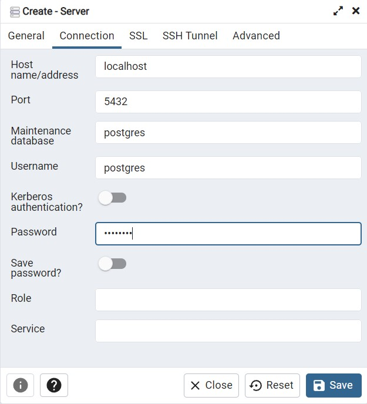
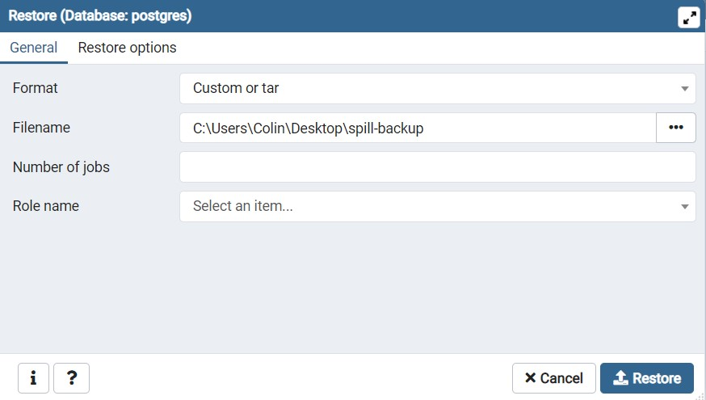
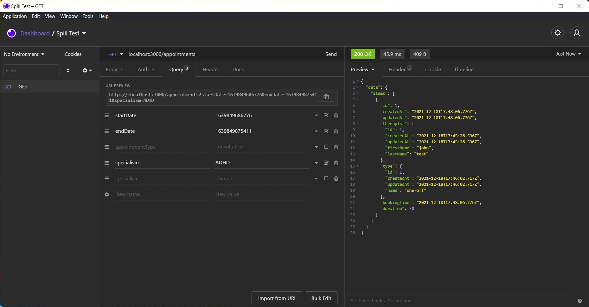

# Spill Backend Test

Spill backend test

This project was bootstrapped via [typescript-starter](https://github.com/bitjson/typescript-starter)

## Getting Started

These instructions will get you a copy of the project up and running on your local machine

NOTE: This is not intended to be used in production.

Some decisions were made (no env variables) and hardcoded secrets to speed up development

### Prerequisites

I only recommend using docker to setup and run the project and it is super simple

- [Docker](https://www.docker.com/products/docker-desktop)
- [Docker Compose](https://docs.docker.com/compose/install/)
- [pgAdmin](https://www.pgadmin.org/download/) - To setup the database

### Installing

Start the stack

```
docker-compose up
```

Now connect to the database instance and restore the `postgres` collection
using `spill-backup` file

Here I use pgAdmin to connect to the database, the password is `password`
as defined in `docker-compose.yml`


Now restore the database from `./spill-backup` file as supplied in the project root.
This creates the tables with the correct schema with some test data


Now you can send a request to `localhost:3000/appointments` like so



The query params can be any combination of

- `startDate`
- `endDate`
- `appointmentType`
- `specialism`

and each have basic validation

## Running the tests

Whilst we can also run our tests in docker we might want to run them locally when developing

First install the dependencies locally, you will need node and yarn.

```
yarn
```

Then run tests

```
yarn run test
```

## Reasons into technical decisions

- [Mikro-ORM](https://mikro-orm.io/) - Abstraction for the data layer (transactions, SQL queries)
  - We're using a typed language, it makes sense to have strong typing on our data models
- [Fastify](https://www.fastify.io/) - As the name implies its really fast
  - Comes with a tonne of features out of the box (ex. validation)
- Built with docker - Allowing you to easily run the application
- ESLint & Prettier - Standard linting / pretty tooling

## Future work

Due to a lack of time I'll discuss improvements here that I didn't get to implement

- Testing
  - This was limited to two files a unit and integration test
  - If given more time I would've like to spend time writing an integration
    test for the route that hits against a test database
- Observability and Monitoring
  - Add [Sentry](https://sentry.io/welcome/) to detect bugs
  - Depending on the cloud platform you'd want to log critical parts, example the initial request
  - Alerting can be added in depending on what monitoring setup you have (Cloudwatch alarms based off cloudwatch logs)
- Adding appointment slots
  - Currently this can only be done by manually inserting into the database via SQL
  - Adding an additional POST /appointments route to create the appointment would be trivial
  - Extending with PATCH & DELETE completes the CRUD route
